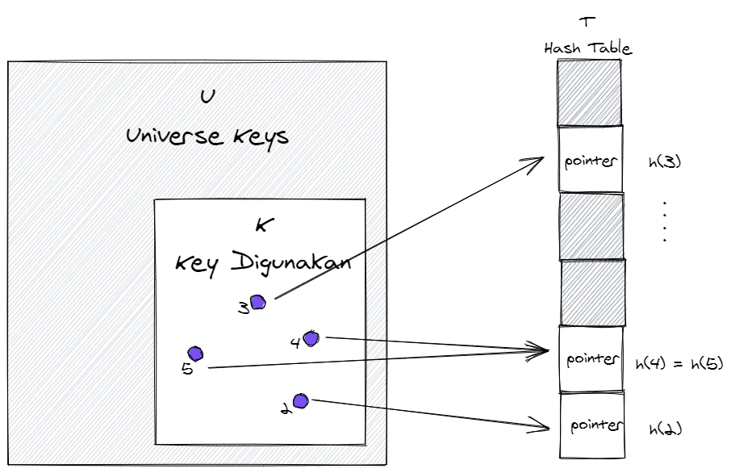

## IF5020 - Hash Table
<sup><sub>**Aditya Rachman Putra** (23520032)</sub></sup>

Dimana akan dibahas mengenai ide paling sederhana yang mendasari hash table ([direct address](#/)), lalu dikembangkan dengan implementasi [menggunakan chaining](#/) dan [open addressing](#/) sembari membahas mengenai [rancangan hash function](#/). Dan terakhir membahas mengenai desain dan performa [perfect hashing](#/)

---
# Direct Access

Hash Table merupakan Implementasi _dictionary_ (_dynamic set_ yang support operasi INSERT, SEARCH dan DELETE) yang efektif, karena dengan rancangan yang baik dapat memberikan performa rata-rata (untuk keseluruhan operasi) sebesar `$O\left(1 \right)$`.

**Direct Address**, implementasi naif yang mengambil ide hash-table, menggeneralisir array sederhana dengan performa akses suatu element menjadi trivial `$O\left( 1 \right)$`.

--
## Overview
Salah satu pengembangan dari array, dimana kita menggunakan _key_ untuk menentukan lokasi indeks array yang akan kita akses (untuk operasi dictionary).

--
### Cara Kerja
Bila dibutuhkan suatu _dynamic set_ dengan syarat:
- setiap elemen memiliki **_key_** yang berbeda satu sama lain
- _key_ tersebut diambil dari semesta `$U = \{0,1,...,m-1\}$` (terdapat m _keys_ berbeda)
- m cukup kecil

Kita bisa membuat tabel _direct-address_ `$T$` dengan m buah **_slot_** yang berkorespondensi 1:1 dengan _keys_ yang ada di semesta `$U$`
--


<small> Bisa diamati bahwa _key_ digunakan berulang kali (untuk menentukan _slot_ dan disimpan dalam elemen), bila `$K$` hanya sebagian kecil dari `$U$`, akan banyak _slot_ kosong di `$T$`</small>

--
### Performa
```
DIRECT-ADDRESS-INSERT(T,k)
T[x.key] = x

DIRECT-ADDRESS-SEARCH(T,k)
return T[k]

DIRECT-ADDRESS-DELETE(T,k)
T[x.key] = NIL
```
Karena kesederhanaan strukturnya, operasinya pun cukup trivial, sehingga performa untuk ketiga operasi ini hanya butuh waktu `$O \left(1\right)$`

--
### Alternatif


<small> Element bisa disimpan langsung dalam slot. Tanpa pointer yang menunjuk ke element tersebut. Atau element disimpan tanpa key karena dapat dilihat dari index slot tabel `$T$`. Alternatif ini perlu menggunakan simbol tertentu yang menandakan suatu slot kosong.</small>

---
# Hash Tables

Masalah dari tabel _direct-addressing_ terlihat bila semesta `$U$` cukup besar, kurang praktis untuk membuat tabel `$T$` sebesar `$|U|$` atau bahkan melebihi kemampuan memori komputer pada umumnya. Ditambah lagi `$K$` _keys_ yang sebenarnya disimpan mungkin hanya sebagian kecil dari keseluruhan `$U$` sehingga akan banyak slot tabel yang tidak digunakan. Untuk kasus tersebut _Hash Table_ merupakan alternatif yang lebih sesuai.

--
## Overview

Dengan menggunakan hash table, kita bisa memperkecil requirement penyimpanan yang digunakan.
`$$\Theta(|U|) \rightarrow \Theta(|K|) $$`
Tapi hal tersebut direalisasikan dengan penurunan performa waktu SEARCHING tabel, dari worst case `$O \left(1\right)$` menjadi **average-case** `$O \left(1\right)$`

--
### Konsep Hash Table
Pembeda hash table dengan direct-access table adalah penggunaan suatu **hash function** `$h \left(k\right)$` untuk memetakan _key_ `$k$` dalam semesta `$U$` kedalam slot yang ada pada hash table `$T[0,1,...,m-1]$`, dengan `$m$` merupakan banyaknya slot dalam hash table.

--

<small>Ukuran `$m` biasanya jauh lebih kecil dibandingkan dengan `$|U|$`, dengan begitu _hash function_ dapat mengurangi ukuran table `$T$`. Namun hal ini menyebabkan 2 _key_ bisa memiliki nilai hash yang sama (**collision**), disini datangnya chaining untuk menyelesaikan _collision_ ini</small>

--
### Collision dalam Hash Table
Idealnya _collision_ bisa dihindari (atau diminimalisir) dengan hash function `$h$` yang tepat. Namun karena dipilih `$m \lt |U|$`, maka setidaknya akan ada 2 _key collision_, sehingga akan lebih produktif untuk fokus pada meminimalisir _collision_ dan menentukan apa yang dilakukan bila _collision_ terjadi.

--
### Penggunaan Metode Chaining
Metode **chaining** menyimpan semua _key_ dengan nilai hash yang sama dalam satu _linked list_ dalam slot _nilai hash_ di `$T$`. Untuk menyederhanakan operasi DELETE, digunakan doubly linked list agar saat element dihapus, kita bisa langsung menghubungkan elemen sebelum dan sesudah elemen yang dihapus.

--

<small>_key_ dengan nilai hash yang sama disimpan dalam satu _linked list_ di slot yang sama</small>

--

<small>DELETE dalam _doubly linked list_ menjadi operasi yang trivial</small>

--
### Operations
``` none
CHAINED-HASH-INSERT(T,x)
insert x at the head of T[h(x.key)]

CHAINED-HASH-SEARCH(T,k)
search for an element with key k in list T[h(k)]

CHAINED-HASH-DELETE(T,x)
delete x from the list T[h(x.key)]
```
Worst Case INSERT : `$O \left(1\right)$`, Element DELETE : `$O \left(1\right)$`, Jadi performa secara kesuluruhan akan sangat bergantung pada performa dari operasi SEARCH.

--
### Analisa Performa SEARCH
Terdapat beberapa konteks dalam analisa ini:
- **Load factor** `$\alpha = n/m$`, menunjukkan rata-rata banyak elemen dalam satu slot
- Untuk metode _chaining_ `$\alpha > 1$`
- Worst case hashing dengan _chaining_: semua `$n$` _keys_ memiliki nilai hash yang sama, membuat list sepanjnang `$n$`, dan search time `$\Theta(n)$`
- Asumsi setiap elemen sama mungkinnya untuk di hash ke setiap slot tanpa bergantung pada elemen lainnya (**simple uniform hashing**)

--
### Cont'd
- `$j = 0,1,...,m-1$` sebagai index slot tabel `$T$`,
- `$n_j = |T[j]|$` sebagai panjang list di dalam slot `$j$`, sehingga
- `$n = n_0 + n_1 + ... + n_{m-1}$`
- expected value `$n_j$` adalah `$E[n_j]=\alpha$`

Performa SEARCH bergantung pada jumlah elemen `$T[h(k)]$` ayng diakses, untuk itu diamati ekspektasi jumlah elemen baik saat SEARCH gagal maupun berhasil. Ingat analisa ini berdasarkan asumsi **siple uniform hashing**
--
#### Performa SEARCH gagal
- SEARCH gagal bila _key_ `$k$` yang dicari tidak ada dalam list `$T[h(k)]$` (pencarian sampai akhir list)
- Asumsi `$k$` memiliki kemungkinan yang sama untuk masuk ke setiap slot `$T$`
- Ekspektasi panjang list `$T[h(k)]$` adalah `$E[n_{h(k)}] = \alpha$`

Dengan begitu ekspektasi banyaknya elemen yang diperiksa sama dengan ekspektasi panjang list, yaitu `$\alpha$`. Dengan memperhitungkan waktu untuk hashing, maka **rata-rata performa SEARCH adalah `$\Theta(1+\alpha)$`**
--
#### Performa SEARCH berhasil
Kalkulasi performa SEARCH berhasil lebih tricky dibanding SEARCH gagal.
- Asumsi setiap elemen dalam `$n$` memiliki kemungkinan yang sama untuk dicari
- Banyak elemen yang diperiksa sama dengan jumlah elemen dalam list sebelum elemen `$x$` yang dicari.
- Karena elemen baru dalam list disimpan di depan, berarti elemen sebelum `$x$` dimasukan setelah `$x$` dimasukan.

--
<!-- .element height="40%" width="40%" -->
<small>Untuk menghitung ekspektasi element setelah `$x$`, bisa dirata-ratakan ekspektasi banyak elemen yang dimasukan ke list tersebut setelah `$x$`.
Untuk itu kita perlu indicator variable `$X_{ij} = I\{h(k_i) = h(k_j)\}$` untuk menunjukan setelah elemen `$i$` dimasukkan, kemungkinan elemen `$j = \{i+1,i+2,..,n\}$` dimasukan ke list yang sama dengan `$i$`. Dengan asumsi _simple uniform hashing_ `$E[X_{ij}] = 1/m$`</small>

--
Elemen yang diperiksa dalam pencarian sukses:

<sub><sup>(rata-rata ditambah 1 agar elemen yang dicari ikut dihitung)</sup></sub>

<sub><sup><small>`$$\begin{aligned}
& E\left[ \frac{1}{n} \sum_{i=1}^{n} \left(1+\sum_{j=i+1}^{n}X_{ij}\right) \right]\\
=& \frac{1}{n} \sum_{i=1}^{n} \left(1+\sum_{j=i+1}^{n}E[X_{ij}]\right) \\
=& \frac{1}{n} \sum_{i=1}^{n} \left(1+\sum_{j=i+1}^{n}\frac{1}{m}\right) \\
=& 1 + \frac{1}{nm} \sum_{i=1}^{n} (n-i) \\
\end{aligned}
$$`</small></sup></sub>

--
<sub><sup><small>`$$\begin{aligned}
=& 1 + \frac{1}{nm} \left( \sum_{i=1}^{n}n - \sum_{i=1}^{n}i \right) \\
=& 1 + \frac{1}{nm} \left( n^2 - \frac{n(n+1)}{2} \right) \\
=& 1 + \frac{n-1}{2m} \\
=& 1 + \frac{\alpha}{2} -\frac{\alpha}{2n}
\end{aligned}
$$`</small></sup></sub>

--
## Kesimpulan Performa

Maka, total waktu yang dibutuhkan (termasuk menghitung hash function) adalah `$\Theta(2+\alpha/2-\alpha/2n) = \Theta(1+\alpha)$`

Untuk hash table dengan slot `$n$` yang setidaknya proportional dengan jumlah element `$n$`, (berdasarkan definisi notasi Big-O) `$n = O(m)$`. Sehingga `$\alpha = n/m = O(m)/m = O(1)$` untuk kasus umum. Sehingga, **hash table dapat melakukan operasi dictionary dalam waktu rata-rata `$O(1)$`**
---
# Hash Functions
Bila sebelumnya kita mengabstraksi hash function sebagai fungsi yang memenuhi _simple uniform hash_, pada bagian ini kita akan membahas contoh hash function dan memilih hash function yang dapat mendekati _simple uniform hashing_ untuk mendapat performa yang cukup baik.
Untuk bahasan kedepan, seluruh **_key_ direpresentasikan sebagai bilangan natural**. Misal bila _key_ berupa character, itu akan diubah menjadi representasi radixnya.

--
### Division Method
`$$h(k) = j\, mod\, m$$`
Pendekatan metode pembagian direpresentasikan oleh persamaan di atas.
- Karena hanya butuh 1 operasi pembagian, metode ini **cepat**
- Nilai `$m = 2^p$` umumnya dihindari
- Bilangan prima yang cukup jauh dari `$2^p$` umumnya digunakan.

--
### Multiplication Method
`$$h(k) = \lfloor m (k A\, mod\,1) \rfloor$$`
Terdiri dari 2 tahap:
- Dengan konstanta`$A$`, dimana`$0<A<1$`, dikalikan dengan key `$k$`lalu ambil bagian pecahannya saja
- Lalu kalikan nilai ini dengan `$m$` dan bulatkan ke bawah.

--
#### Implementasi Metode Perkalian
Implementasi metode ini pada komputer membutuhkan penyesuaian berikut untuk mempermudah komputasi
- Pilih `$m=2^p$` untuk mempermudah implementasi
- misal word size mesin adalah `$w$` dan `$k$` muat dalam satu word
- Kita pilih `$A = s/2^w$`dimana `$s$` bilangan natural

--
#### Proses Metode Perkalian


Hitung `$k \times s$` yang menghasilkan nilai `$\text{2w-bit}$` `$r_12^w+r_0$`. Ekstrak hasil nilai hash sebesar `$\text{p-bit}$` dari `$p\, MSB\, r_0$`. Knuth merekomendasikan `$A \approx (\sqrt{5}-1)/2 = 0.6180339887...$`

---
# Universal Hashing
**Universal Hashing** memiliki pendekatan yang mirip dengan _randomized algorithm_, dapat meningkatkan performa secara umum terlepas dari distribusi inputnya.

--
## Definisi
Untuk suatu koleksi hash function `$]\mathscr{H}$` yang memetakan suatu semesta _keys_ `$U$` kedalam range `$\{0,1,2,...,m-1\}$` bisa dibilang **universal** bila setiap pasangan _keys_ `$k,l \in U $`, jumlah hash function `$h \in \mathscr{H}$` dimana `$h(k)=h(l)$` tidak lebih dari `$|\mathscr{H}|/m$`

--
### Sifat umum
Untuk suatu hash table dengan resolusi menggunakan chaining, dengan `$h$` dipilih dari kelas hash universal, dengan _key_ `$k$` yang di hash, maka:
- bila `$k$`tidak ada di tabel, `$E[n_{h(k)}]$` tidak lebih dari `$\alpha$`
- bila `$k$` di dalam tabel, `$E[n_{h(k)}]$` tidak lebih dari `$1+  \alpha$`
- operasi INSERT, SEARCH, dan DELETE ekspektasi performanya tidak akan lebih buruk dari `$\Theta(n)$`

--
## Merancang Universal Hash Functions
- Pilih suatu angka prima `$p$` sehingga `$0 \geq k \geq p-1$`, sehingga `$p \gt m$`
- `$\mathbb{Z}_p = \{0,1,...,m-1\}$` dan `$\mathbb{Z}_p^* = \{1,2,...,m\}$`
- dengan `$a \in \mathbb{Z}_p$` dan `$b \in \mathbb{Z}_p^*$`, dipilih hash function `$h_{ab}(k) = ((ak+b)\, mod\, p)\, mod\,m$`
- Koleksi dari hash function seperti itu didefinisikan sebagai: `$\mathscr{H}_{pm}=\{h_{ab}:a \in \mathbb{Z}_p^*\,dan\, b \in \mathbb{Z}_p\}$`
- `$\mathscr{H}_{pm}$` memiliki `$p(p-1)$` hash function.

---
# Open Addressing
Dalam **open addressing** semua elemen disimpan di dalam hash table. Sehingga tidak ada list maupun elemen yang berada di luar hash table. Karena sifat tersebut, hash table dapat penuh, load factor tidak akan melebihi 1 (`$\alpha < 1$`)

--
## Sifat Open Address
- Elemen tidak disimpan menggunakan pointer (langsung di dalam tabel)
- Pencarian tidak mengikuti pointer, melainkan dengan mengkomputasi urutan slot yang diperiksa
- Untuk melakukan INSERT, hash table diperiksa (**probe**) hingga menemukan slot kosong untuk menyimpan _key_
- Karena urutan tidak akses sudah bukan 0,1,...,m-1, urutan posisi yang di akses bergantung terhadap _key_ yang digunakan
--
## Probe Sequence
<small>Untuk mengakomodasi sifat tersebut, hash function diubah sehingga menghasilkan urutan probe.
`$$h:U \times \{0,1,...,m-1\} \rightarrow \{0,1,...,m-1\}$$`
dengan urutan probe `$\langle h(k,0),h(k,1),...,h(k,m-1)\rangle$` merupakan permutasi dari `$\langle 0,1,...,m-1 \rangle$`</small>

--
## Operation

--
### Open Address INSERT
``` none
HASH-INSERT(T,k)
repeat
    j = h(k,i)
    if T[j] == NIL
        T[j] = k
        return j
    else i = i+1
until i == m
error "hash table overflow"
```

--
### Open Address SEARCH
``` none
HASH-INSERT(T,k)
i = 0
repeat
    j = h(k,i)
    if T[j] == k
        return j
    i = i+1
until T[j] == NIL or i == m
return NIL
```
<small>algoritme SEARCH memeriksa urutan yang sama dengan INSERT untuk _key_ tersebut. SEARCH dianggap gagal saat menemukan NIL (karena bila key yang dicari sudah di INSERT, tidak mungkin NIL sebelum menemukan key tersebut) </small>

--
### Open Address DELETE
<small>
Melakukan DELETE pada open address tidak bisa dilakukan hanya dengan mengisi slot tersebut dengan NIL. Karena elemen setelah key yang dihapus tersebut akan jadi tidak bisa diakses karena SEARCH terlanjur menemukan NIL tersebut.

Opsi lain adalah menggunakan flag DELETED untuk menandai slot yang _key_ nya dihapus dan memodifikasi INSERT untuk memperlakukan flag tersebut layaknya slot kosong, namun untuk SEARCH tidak dianggap sebagai slot kosong.

Namun pada praktiknya bila butuh hash table dengan key yang bisa di hapus, digunakan metode resolusi dengan chaining dibandingkan open address.
</small>

--
## Uniform Hashing
- Uniform hashing berarti urutan _probe_ untuk setiap _key_ memiliki kemungkinan yang sama untuk `$m!$` permutasi dari `$\langle0,1,...,m-1 \rangle$`
- Merupakan generalisasi dari _simple uniform hasing_
- Sulit untuk benar-benar dilakukan
- Linear Probing, Quadratic Probing, dan Double Hashing belum memenuhi syarat _uniform hashing_ (generate `$ \leq m^2$` urutan)

--
### Linear Probing
dengan **auxiliary hash function** berupa hash function biasa `$h' : U \rightarrow \{0,1,...,m-1 \}$`, metode linear probing menggunakan hash function:

`$$h(k,i) = (h'(k) + i)mod\, m$$`

--
<sub>Hash Table T</sub>

|h(k,3)|h(k,4)|h(k,5)|h(k,0)|h(k,1)|h(k,2)|
|--|--|--|--|--|--|

`$h(k,0)$` memberikan nilai yang berbeda untuk tiap keys, sehingga hanya terdapat `$m$` urutan probe berbeda.

Karena sifat berurutan linear probe, metode ini rentan **primary clustering** dimana slot yang terisi berurutan semakin mungkin untuk menjadi semakin panjang. Ini akan membuat waktu SEARCH semakin lama.
--
### Quadratic Probing
`$$h(k,i) = (h'(k) + c_1i+ c_2i^2)mod\, m$$`

Dengan `$0 \lt c_1, c_2 $`berupa konstanta. metode ini bekerja lebih baik dibanding linear probing, namun nilai `$c_1,c_2, \text{dan}\, m$` perlu dipilih sedemikian rupa agar seluruh slot di hash table digunakan oleh metode ini.

Metode ini mengalami clustering yang lebih ringan (**secondary clustering**), dan karena probe awal `$h(k,0)$` menentukan keseluruhan urutan, maka metode ini juga hanya menghasilkan `$m$` urutan berbeda.
--
### Double Hashing
`$$h(k,i) = (h_1(k) + ih_2(k))\, mod\,m $$`
<small>(`$h_2(k)$` perlu relatif prima terhadap `$m$` agar semua slot tabel digunakan)</small>

Salah satu metode terbaik untuk open addressing. Berbeda dengan linear dan quadratic, urutan bergantung dengan 2 cara yang berbeda terhadap key `$k$`. Ini menyebabkan setiap pasang `$(h_1(k),h_2(k))$` menghasilkan urutan probe berbeda. Sehingga terdapat `$\Theta(m^2)$` urutan probe.

--
## Analisa dari Open Address Hashing

Menganalisa ekspektasi jumlah _probes_ untuk _hashing_ menggunakan parameter `$\alpha$`, dengan batasan:
- `$ n \leq m$`
- `$\alpha \leq 1$`

dan asumsi kita menggunakan _Uniform Hashing_ sehingga urutan probing `$\langle h(k,0), h(k,1), ...,h(k,m-1)\rangle$` memiliki kemungkinan yang sama-rata untuk berupa permutasi dari `$\langle 0,1,...,m-1\rangle$`.

--
Artinya apa?
Dengan memperhitungkan ruang kemungkinan _keys_ dan operasi yang dilakukan _hash function_ terhadap _keys_ tersebut, **masing-masing urutan probing memiliki kemungkinan yang sama untuk terjadi**.

--
## Analisa Ekspektasi Jumlah Probes

--
### Jumlah _Probes_ bila Pencarian Gagal
Dimana kita akan membuktikan bahwa dengan load factor `$\alpha \lt 1$`, ekspektasi jumblah _probes_ yang dilakukan dalam pencarian gagal tidak akan lebih kecil dari `$1/(1-\alpha)$`. Dengan asumsi bahwa telah terdapat `$n$` elemen yang mengisi keseluruhan `$m` slot.

Pencarian gagal terjadi bila:
- Setiap slot yang di-_probe_ sebelum slot terakhir telah terisi oleh nilai selain yang dicari, dan
- Slot terakhir yang di-_probe_ merupakan slot kosong.

--
Karena kita ingin mengetahui ekspektasi _probes_ yang dilakukan, maka:
- Digunakan `$X$` sebagai _random variable_ jumlah _probe_ dalam pencarian yang gagal.
- Event `$A_i$` dengan `$i = 1,2,...$` mengindikasikan terjadi _probe_ ke i terhadap slot terisi.
- Event `$\{X \geq i\}$` terjadi bila event`$A_1,...,A_{i-1}$` terjadi.
- Karena asumsi terdapat `$n$` element dalam `$m$` slots, maka kemungkinan event `$A_1$` terjadi adalah `$n/m$`

--
Untuk mendapatkan nilai ekspektasi jumlah _probes_ `$E[X]$`, kita perlu mengetahui kemungkinan jumlah _probes_ yang melebihi suatu nilai i `$Pr\{X \geq i\}$`
- Mari kita ambil nilai `$j > 1$` untuk menunjukan kemungkinan slot ke-j telah terisi given j-1 _probes_ sebelumnya dilakukan terhadap slot yang telah terisi juga.
- Karena `$A_1 = n/m$` maka _probe_ selanjutnya sisa items yang mungkin di akses adalah n-1 dan sisa slot m-1, Maka `$A_2$` kemungkinan probe ke-2 adalah `${n-1}/{m-1}$` sehingga membentuk deret.

--

`$$\begin{aligned}
Pr\{X \geq 1\} &= A_1, A_2, ..., A_{i-1} \\
&= \frac{n}{m} \cdot  \frac{n-1}{m-1} \cdot \cdot \cdot  \frac{n-i+2}{m-i+2} \\
&\leq \left( \frac{n}{m}^{i-1} \right) \\
&= \alpha^{i-1} \\
\end{aligned}$$`

--
Sehingga Ekspektasi jumlah probe:

<small>`$$\begin{aligned}
E[X] &= \sum_{i=1}^{\infty}Pr\{X \geq i\} \\
&\leq \sum_{i=1}^{\infty}\alpha^{i-1} \\
&= \sum_{i=0}^{\infty}\alpha^i \\
&= \frac{1}{1-\alpha} \\
\end{aligned}$$`</small>

<small>Bila load factor static, maka operasi search gagal dapat dilakukan dalam `$O(1)$`</small>

--
### Jumlah Probes Pencarian Berhasil
<small>bila `$k$` merupakan _key_ ke `$i+1$` yang dimasukkan ke tabel, maka ekspektasi probe yang dilakukan tidak melebihi `$1/(1-i/m) = m/(m-i)$`. Sehingga rata-rata banyaknya probe yang dilakukan adalah:
<sub><sup>`$$\begin{aligned}
\frac{1}{n}\sum_{i=0}^{n-1}\frac{m}{m-i} &= \frac{m}{n}\sum_{i=0}^{n-1}\frac{1}{m-i} \\
&= \frac{1}{\alpha}\sum_{k=m-n+1}^{m}\frac{1}{k} \\
&\leq \frac{1}{\alpha}\int_{m-n}^{m}(1/x)dx) \\
&= \frac{1}{\alpha}ln\,\frac{m}{m-n} \\
&= \frac{1}{\alpha}ln\,\frac{1}{1-\alpha} \\
\end{aligned}$$`</sup></sub></small>

--
### Performa Operasi INSERT
Operasi insert memiliki performa seperti SEARCH yang gagal, bila search gagal karena probe menemukan slot kosong, INSERT berhasil saat menemukan slot kosong tersebut.

---
# Perfect Hashing

teknik hashing disebut **Perfect hashing** bila untuk kasus terburuk dibutuhkan `$O(1)$` untuk operasi SEARCH , perfect hashing dilakukan dengan secondary hash table, dimana terdapat hash table `$T_j$` di dalam `$T[j]$`.
Tantangannya adalah merancang hash secondary hash table yang bisa memastikan tidak ada collision dari keysnya. Sembari tetap membatasi penggunaan storage untuk menyimpan tabel tersebut.
--


<small>tingkatan hash pertama sama dengan hash table biasa (hash function diambil dari kelas universal hash function `$\mathscr{H}_pm$`). Namun kita tidak menyimpan list dalam masing-masing slot `$j$`, tapi dipilih **secondary hash table** `$S_j$` dengan hash function `$h_j$` beserta ukuran secondary hash table `$m_j = n_j^2$` agar tidak terjadi collision.</small>

--
## Memastikan Tidak ada Collision
Misal pada suatu hash table, dengan `$X$` sebagai random variable suatu pasangan _keys_ bertabrakan, kita dapat mengetahui ekspektasi jumlah  pasangan _keys_ yang bertabrakan.

<small>`$$\begin{aligned}
E[X] &= \binom{n}{2} \cdot \frac{1}{n^2} \\
&= \frac{n^2-n}{2}\cdot\frac{1}{n^2} \\
&\lt 1/2
\end{aligned}$$`</small>

--
Dari hasil tersebut, untuk `$m = n^2$` kemungkinan sangat kecil untuk terjadi collision. Namun untuk nilai `$n$` yang cukup besar, ukuran hash table akan membludak. Untuk itu digunakan 2-tingkat hash table

- hash table pertama menggunakan hash function `$h$` untuk memetakan _keys_ ke `$m=n$` buah slot
- bila `$n_j$` buah _keys_ di hash ke slot `$j$` , maka digunakan _secondary hash table_ `$S_j$` sebesar `$m_j = n_j^2$`

**Ini menghasilkan performa yang bebeas collision dengan waktu lookup konstan.**

--
## Memastikan Penggunaan Memori
Karena `$m_j$` bergantung secara kuadratik terhadap `$n_j$`, perlu dibuktikan bahwa penggunaan penyimpanan tidak akan berlebih. Dan tetap memiliki penggunaan memori `$O(n)$`

Untuk itu mari kita amati ekspektasi jumlah slot _secondary_ `$n_j^2$`

--
<sup><sub><small>`$$\begin{aligned}
E \Bigg[ \sum_{j=0}^{m-1} &n_j^2 \Bigg] \\
&= E\Bigg[\sum_{j=0}^{m-1} \left(n_j + 2\binom{n_j}{2} \right)\Bigg] \\
&= E\Bigg[\sum_{j=0}^{m-1} n_j \Bigg] + 2E \Bigg[\sum_{j=0}^{m-1}\binom{n_j}{2}\Bigg] \\
&= E[n] + 2E \Bigg[\sum_{j=0}^{m-1}\binom{n_j}{2}\Bigg] \\
&= n + 2E \Bigg[\sum_{j=0}^{m-1}\binom{n_j}{2}\Bigg]
\end{aligned}$$`</small></sub></sup>

<small>bisa diamati bahwa `$\sum_{j=0}^{m-1}\binom{n_j}{2}$` adalah jumlah pasangan keys yang bertabrakan. Berdasarkan sifat universal hashing, ekpektasi nilai ini tidak lebih dari:</small>

--
<small><sub><sup>`$$\begin{aligned}
\binom{n}{2} \frac{1}{m} &= \frac{n(n-1)}{2m} \\
&= \frac{n-1}{2} \\
\end{aligned}$$`</sup></sub>
Sehingga ekspektasi jumlah `$n_j$` tidak akan lebih dari
<sub><sup>`$$\begin{aligned}
E \Bigg[\sum_{j=0}^{m-1}n_j^2\Bigg] &\leq n + 2 \frac{n-1}{2} \\
&= 2n - 1 \\
&\lt 2n
\end{aligned}$$`</sup></sub>
Ini menunjukkan bahwa ekspektasi jumlah penyimpanan yang dibutuhkan oleh secondary hashing kurang dari 2n.</small>

--
### Penggunaan Penyimpanan Perfect Hashing
<small>Lalu bila dilihat menggunaan Pertidaksamaan Markov `$Pr\{X \geq t\} \leq E[X]/t$`, maka dengan `$X = \sum_{j=0}^{m-1}m_j$` dan `$t = 4n$` bisa didapatkan:

`$$\begin{aligned}
Pr\Bigg\{ \sum_{j=0}^{m-1} m_j \geq 4n \Bigg\}  &\leq \frac{E[\sum_{j=0}^{m-1}m_j]}{4n} \\
&\lt \frac{2n}{4n} \\
&= 1/2 \\
\end{aligned}$$`

Ini menunjukkan bahwa ekspektasi penyimpanan lebih dari `$4n$` adalah kurang dari 0.5, artinya bila kita memilih beberapa hash function dari universal hash function, setidaknya lebih daari setengahnya menggunakan penyimpanan kurang dari `$4n$` </small>
